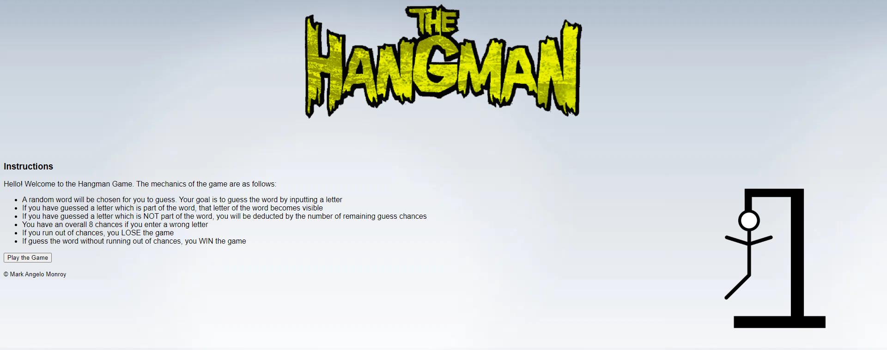
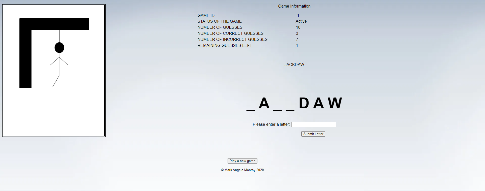

# The Online Hangman Game using REST API

*Instructions*

* Install Gradle on your System 
* You can use Intellij Community to be able to run the Gradle
* Once you run this, the API is usually hosted at *8080* port

*Mechanics of the Game*
# <h5> Hello! Welcome to the Hangman Game. The mechanics of the game are as follows:

1. A random word will be chosen for you to guess. Your goal is to guess the word by inputting a letter
1. If you have guessed a letter which is part of the word, that letter of the word becomes visible
1. If you have guessed a letter which is NOT part of the word, you will be deducted by the number of remaining guess chances
1. You have at MOST 7 chances if you enter a wrong letter
1. If you run out of chances, you LOSE the game
1. If guess the word without running out of chances, you WIN the game

*Screenshots*

